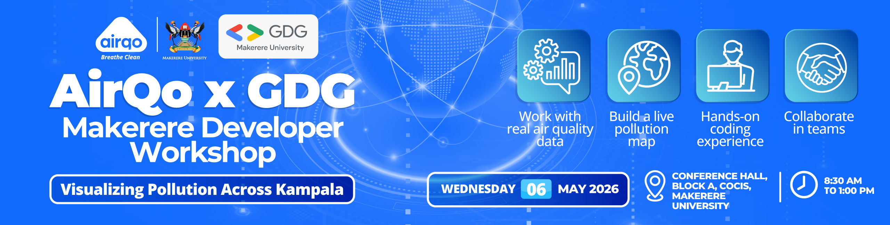

# Google Maps JavaScript API Workshop



A comprehensive, hands-on workshop repository for learning Google Maps JavaScript API fundamentals through progressive demonstrations. This repository serves as both a live tutorial during workshop presentations and a reference implementation for attendees.

## Workshop Topics

- **Maps JavaScript API Basics** - Map initialization and configuration
- **Marker Clustering** - Efficient visualization of large marker datasets
- **Heatmap Layers** - Density visualization with customizable gradients
- **Places API** - Location search with autocomplete functionality
- **GeoJSON Overlay** - External data integration and styling

## Project Structure

```
maps-workshop/
├── assets/              # Images and media files
│   └── AIRQO-GDG-banner.jpeg
├── src/                 # Source code
│   ├── css/            # Stylesheets
│   │   └── style.css
│   ├── js/             # JavaScript files
│   │   ├── app.js      # Main application logic
│   │   └── data.js     # Sample data points
│   └── data/           # Data files
│       └── sample-data.geojson
├── tests/              # Test files and demos
├── index.html          # Main HTML file
└── README.md           # This file
```

## Prerequisites

Before you begin, ensure you have:

1. **Google Cloud Account** - [Create one here](https://console.cloud.google.com/)
2. **Google Maps API Key** - Follow the setup instructions below
3. **Modern Web Browser** - Chrome, Firefox, Safari, or Edge
4. **Text Editor** - VS Code, Sublime Text, or any code editor
5. **Basic JavaScript Knowledge** - Familiarity with JavaScript fundamentals

### Required Google Maps APIs

You need to enable the following APIs in your Google Cloud Console:

- **Maps JavaScript API** - Core mapping functionality
- **Places API** - Location search and autocomplete
- **Visualization API** - Heatmap layer support

## Getting Started

### Step 1: Obtain a Google Maps API Key

1. Go to the [Google Cloud Console](https://console.cloud.google.com/)
2. Create a new project or select an existing one
3. Navigate to **APIs & Services** > **Library**
4. Enable the following APIs:
   - Maps JavaScript API
   - Places API
   - (Visualization API is included with Maps JavaScript API)
5. Navigate to **APIs & Services** > **Credentials**
6. Click **Create Credentials** > **API Key**
7. Copy your API key (you'll need it in the next step)

**Security Note:** For production use, restrict your API key by:
- Setting HTTP referrer restrictions
- Limiting to specific APIs
- Setting usage quotas

### Step 2: Configure Your API Key

1. Open `index.html` in your text editor
2. Find line 62 (the Google Maps API script tag)
3. Replace `YOUR_API_KEY_HERE` with your actual API key:

```html
<!-- BEFORE -->
<script src="https://maps.googleapis.com/maps/api/js?key=YOUR_API_KEY_HERE&libraries=places,visualization&callback=initMap" async defer></script>

<!-- AFTER -->
<script src="https://maps.googleapis.com/maps/api/js?key=AIzaSyD...your-key-here...&libraries=places,visualization&callback=initMap" async defer></script>
```

### Step 3: Run the Application

**Option 1: Using Live Server (Recommended)**
1. Install the [Live Server extension](https://marketplace.visualstudio.com/items?itemName=ritwickdey.LiveServer) for VS Code
2. Right-click on `index.html`
3. Select "Open with Live Server"
4. Your browser will open automatically

**Option 2: Direct File Opening**
1. Simply double-click `index.html`
2. The file will open in your default browser

**Option 3: Using Python HTTP Server**
```bash
# Python 3
python -m http.server 8000

# Then open http://localhost:8000 in your browser
```

## Features & Usage

### Basic Map

The map initializes automatically when you open `index.html`. It's centered on Kampala, Uganda with a zoom level of 12.

**Default Configuration:**
- Center: Kampala, Uganda (0.3476° N, 32.5825° E)
- Zoom: 12
- Map Type: Roadmap
- Controls: Zoom, Map Type, Street View, Fullscreen

### Marker Clustering

Groups nearby markers into clusters for better visualization of large datasets.

**Enable from Console:**
```javascript
enableClustering()
```

**Features:**
- Automatically clusters markers based on zoom level
- Click clusters to zoom in
- Click individual markers to see info windows
- Dynamic clustering as you zoom in/out

**Code Example:**
```javascript
// Create cluster module
const clusterModule = new ClusterModule(map, samplePoints);

// Enable clustering
clusterModule.enable();

// Disable clustering
clusterModule.disable();

// Update data
clusterModule.updateData(newDataPoints);
```

### Heatmap Visualization

Displays data density using color gradients.

**Enable from Console:**
```javascript
enableHeatmap()
```

**Features:**
- Color gradient from blue (low density) to red (high density)
- Weighted data points for intensity variation
- Customizable radius, opacity, and gradient

**Code Example:**
```javascript
// Create heatmap module
const heatmapModule = new HeatmapModule(map, samplePoints);

// Enable heatmap
heatmapModule.enable();

// Customize appearance
heatmapModule.setRadius(30);  // Adjust heat radius
heatmapModule.setOpacity(0.8);  // Adjust transparency
heatmapModule.setGradient([
    'rgba(0, 255, 0, 0)',
    'rgba(255, 255, 0, 1)',
    'rgba(255, 0, 0, 1)'
]);  // Custom gradient
```

### Places API Autocomplete

Location search with autocomplete suggestions.

**Enable from Console:**
```javascript
enablePlaces()
```

**Features:**
- Type-ahead autocomplete suggestions
- Automatic map centering on selected location
- Marker placement at selected location
- Info window with place details

**Code Example:**
```javascript
// Create places module
const placesModule = new PlacesModule(map, 'search-input');

// Enable places
placesModule.enable();

// The autocomplete is now active on the search input
// Users can type to search for locations
```

### GeoJSON Overlay

Load and display external GeoJSON data on the map.

**Enable from Console:**
```javascript
enableGeoJSON()
```

**Features:**
- Loads GeoJSON from local or remote URLs
- Custom styling for features (polygons, lines, points)
- Click features to see properties
- Supports FeatureCollection format

**Code Example:**
```javascript
// Create GeoJSON module
const geoJsonModule = new GeoJSONModule(map, 'sample-data.geojson');

// Enable GeoJSON overlay
await geoJsonModule.enable();

// Customize styling
geoJsonModule.setStyle({
    fillColor: '#FF0000',
    strokeColor: '#990000',
    strokeWeight: 3,
    fillOpacity: 0.5
});
```

## Console Commands

All features can be controlled from the browser console for live demonstrations:

### Clustering Commands
```javascript
enableClustering()   // Enable marker clustering
disableClustering()  // Disable marker clustering
toggleClustering()   // Toggle marker clustering
```

### Heatmap Commands
```javascript
enableHeatmap()      // Enable heatmap visualization
disableHeatmap()     // Disable heatmap visualization
toggleHeatmap()      // Toggle heatmap visualization
```

### Places Commands
```javascript
enablePlaces()       // Enable location search
disablePlaces()      // Disable location search
togglePlaces()       // Toggle location search
```

### GeoJSON Commands
```javascript
enableGeoJSON()      // Enable GeoJSON overlay
disableGeoJSON()     // Disable GeoJSON overlay
toggleGeoJSON()      // Toggle GeoJSON overlay
```

### Utility Commands
```javascript
getActiveModules()   // List currently active modules
getState()           // View application state
help()               // Show all available commands
```

## Data Customization

### Sample Data Structure

The `data.js` file contains sample coordinate points for Kampala, Uganda. Each data point has the following structure:

```javascript
{
    lat: 0.3476,           // Latitude (required)
    lng: 32.5825,          // Longitude (required)
    weight: 85,            // Weight for heatmap (optional, 0-100)
    title: "Location Name", // Marker title (optional)
    description: "Details"  // Marker description (optional)
}
```

### Modifying Sample Data

To use your own data:

1. Open `src/js/data.js`
2. Replace the `samplePoints` array with your data
3. Ensure each point has at least `lat` and `lng` properties
4. Optionally add `weight`, `title`, and `description`

**Example:**
```javascript
const samplePoints = [
    { 
        lat: 40.7128, 
        lng: -74.0060, 
        weight: 90, 
        title: "New York City",
        description: "The Big Apple"
    },
    { 
        lat: 34.0522, 
        lng: -118.2437, 
        weight: 85, 
        title: "Los Angeles",
        description: "City of Angels"
    },
    // Add more points...
];
```

### GeoJSON Data

The `src/data/sample-data.geojson` file contains example GeoJSON features for Kampala. You can replace it with your own GeoJSON data.

**GeoJSON Format:**
```json
{
    "type": "FeatureCollection",
    "features": [
        {
            "type": "Feature",
            "geometry": {
                "type": "Polygon",
                "coordinates": [[[lng, lat], [lng, lat], ...]]
            },
            "properties": {
                "name": "Feature Name",
                "description": "Feature Description",
                "customProperty": "Custom Value"
            }
        }
    ]
}
```

**Supported Geometry Types:**
- Point
- LineString
- Polygon
- MultiPoint
- MultiLineString
- MultiPolygon

## Troubleshooting

### API Key Errors

**Problem:** Map doesn't load, shows error message about API key

**Solutions:**
1. Verify your API key is correctly inserted in `index.html` (line 62)
2. Check that you've enabled all required APIs in Google Cloud Console
3. Ensure your API key doesn't have restrictions that block localhost
4. Check browser console for specific error messages

**Common Error Messages:**
- `"Google Maps API not loaded"` - API key is missing or invalid
- `"RefererNotAllowedMapError"` - API key has referrer restrictions
- `"ApiNotActivatedMapError"` - Required API not enabled in Cloud Console

### Library Loading Issues

**Problem:** Features don't work, console shows library errors

**Solutions:**
1. Verify the API script tag includes `libraries=places,visualization`
2. Check that MarkerClusterer CDN is loading (check Network tab)
3. Ensure you're using HTTPS or localhost (some features require secure context)

**Verify Libraries:**
```javascript
// Check if libraries are loaded
console.log('Places:', typeof google.maps.places);  // Should be 'object'
console.log('Visualization:', typeof google.maps.visualization);  // Should be 'object'
console.log('MarkerClusterer:', typeof markerClusterer);  // Should be 'object'
```

### Module Not Working

**Problem:** Specific module (clustering, heatmap, etc.) doesn't enable

**Solutions:**
1. Check browser console for error messages
2. Verify the module is registered: `getActiveModules()`
3. Try disabling other modules first
4. Refresh the page and try again

**Debug Commands:**
```javascript
// Check module status
stageManager.isModuleActive('clustering')  // Returns true/false

// List all registered modules
Array.from(stageManager.modules.keys())  // Returns array of module names

// Check for errors
stageManager.enableModule('clustering')  // Will show detailed error if any
```

### Data Not Displaying

**Problem:** Markers or heatmap don't show on the map

**Solutions:**
1. Verify `samplePoints` is loaded: `console.log(samplePoints.length)`
2. Check that coordinates are valid (lat: -90 to 90, lng: -180 to 180)
3. Ensure map is zoomed to the correct region
4. Try centering map on your data: `map.setCenter({lat: yourLat, lng: yourLng})`

## Workshop Presentation Tips

### Live Demonstration Flow

1. **Start with Basic Map** - Show the initialized map
2. **Enable Clustering** - Demonstrate marker grouping
3. **Zoom In/Out** - Show dynamic clustering behavior
4. **Enable Heatmap** - Show density visualization
5. **Toggle Between Features** - Show conflict warnings
6. **Use Places Search** - Search for a location
7. **Enable GeoJSON** - Show external data overlay
8. **Use Console Commands** - Demonstrate live control

### Console Workflow

```javascript
// 1. Show help
help()

// 2. Enable clustering
enableClustering()

// 3. Check active modules
getActiveModules()

// 4. Enable heatmap (will show conflict warning)
enableHeatmap()

// 5. Disable clustering
disableClustering()

// 6. Enable places
enablePlaces()

// 7. Enable GeoJSON
enableGeoJSON()

// 8. Check state
getState()
```

### Common Questions

**Q: Can I use multiple modules at once?**
A: Yes! All modules can be active simultaneously. Clustering and heatmap may have visual overlap (you'll see a warning).

**Q: How do I customize the map style?**
A: Modify the MapManager configuration in `app.js` or use Google Maps Styling Wizard.

**Q: Can I use this with React/Vue/Angular?**
A: Yes! The modules are framework-agnostic. You can integrate them into any framework.

**Q: How do I add more data points?**
A: Edit `data.js` and add more objects to the `samplePoints` array.

## Additional Resources

### Official Documentation

- [Google Maps JavaScript API](https://developers.google.com/maps/documentation/javascript)
- [Marker Clustering](https://developers.google.com/maps/documentation/javascript/marker-clustering)
- [Heatmap Layer](https://developers.google.com/maps/documentation/javascript/heatmaplayer)
- [Places API](https://developers.google.com/maps/documentation/javascript/places)
- [Data Layer (GeoJSON)](https://developers.google.com/maps/documentation/javascript/datalayer)

### Google Codelabs (Recommended)

These step-by-step tutorials are perfect for learning and reference:

- [Add a Map to Your Website](https://developers.google.com/codelabs/maps-platform/maps-platform-101-js) - The absolute "Hello World" of Google Maps
- [Visualize Data with Heatmaps](https://developers.google.com/codelabs/maps-platform/heatmaps) - Load the visualization library and plot high-density data
- [Marker Clustering Guide](https://developers.google.com/maps/documentation/javascript/marker-clustering) - Use the markerclusterer library for large datasets
- [Nearby Search (Places API)](https://developers.google.com/codelabs/maps-platform/google-maps-nearby-search-js) - Find local businesses or landmarks

### Code Examples

- [Google Maps Samples](https://github.com/googlemaps/js-samples)
- [MarkerClusterer Documentation](https://googlemaps.github.io/js-markerclusterer/)

### Learning Resources

- [Google Maps Platform Training](https://developers.google.com/maps/documentation/javascript/tutorial)
- [GeoJSON Specification](https://geojson.org/)
- [GeoJSON.io](https://geojson.io/) - Create and visualize GeoJSON

## Workshop Context

This repository is part of the **AirQo x GDG Makerere University Workshop** on "Visualizing Pollution Across Kampala". 

**Workshop Flow:**
1. **AirQo API Session** (8:40-9:20 AM) - Learn about AirQo's air quality API and data structure
2. **Google Maps Session** (9:20-10:00 AM) - **This repository** - Learn Maps API features
3. **Build Session** (10:15-12:00 PM) - Integrate AirQo API data with Google Maps to create pollution visualizations

**Integration with AirQo Data:**

During the build session, participants will:
- Fetch real-time air quality data from the AirQo API
- Transform the API response into the data format used by this repository
- Visualize pollution levels using heatmaps (color-coded by PM2.5 levels)
- Display sensor locations using marker clustering
- Show air quality readings in marker info windows

**Example Integration:**
```javascript
// Fetch data from AirQo API (provided during workshop)
const response = await fetch('AIRQO_API_ENDPOINT');
const airQoData = await response.json();

// Transform to our data format
const pollutionPoints = airQoData.map(sensor => ({
    lat: sensor.latitude,
    lng: sensor.longitude,
    weight: sensor.pm2_5,  // Use PM2.5 as heatmap weight
    title: sensor.site_name,
    description: `PM2.5: ${sensor.pm2_5} µg/m³`
}));

// Visualize with heatmap
const heatmapModule = new HeatmapModule(map, pollutionPoints);
heatmapModule.enable();
```

**Note:** This repository provides the Google Maps visualization foundation. The AirQo team will provide their API endpoint and data structure during the workshop.

## License

This project is open source and available for educational purposes.

## Support

If you encounter issues during the workshop:
1. Check the Troubleshooting section above
2. Ask a mentor or workshop facilitator
3. Check browser console for error messages
4. Verify your API key configuration

---

**Happy Mapping!**
